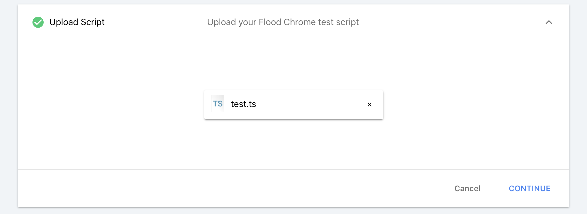

# `@flood/chrome`

Flood Chrome brings the familiar power of traditional browser scripting tools together with the proven performance of Flood to create an easy-to-use and maintainable performance testing tool.

Flood Chrome works by spinning up hundreds or even thousands of instances of Google Chrome, and running scripts you define here to drive a load test. We can this Browser Level Load Testing.

> This project is currently in beta and APIs are subject to change.


# Quickstart

First, make sure you have installed the [latest version of NodeJS](https://nodejs.org) for your platform.

#### 1. Download Flood CLI

**On macOS**, install using homebrew:

```bash
brew install flood-io/taps/flood
```

**On linux**, download the [latest release](https://github.com/flood-io/cli/releases/latest) for your platform, then extract and install it:

```bash
# assuming you're installing version 1.0.0 on linux
cd ~/Downloads
mkdir flood
tar zxvf flood-1.0.0-linux-amd64.zip -C flood

# move the file to somewhere on your $PATH:
mv flood/flood /usr/local/bin/flood

# optionally, tidy up:
rm -rf flood
```

**On Windows:**

We're still working on a Windows build, stay tuned.

#### 2. Initialize Project

The very first thing you should do is authenticate the `flood` tool with your Flood account. _If you don't have an account, you can sign up for free at [Flood](https://flood.io)._

```bash
# Login
flood login

# Initialize a new project
flood init my-flood-chrome-test

# Change to this directory and install dependencies
cd my-flood-chrome-test
yarn install
```

#### 3. Write and validate your script

Edit `test.ts` in your editor of choice. To learn more about the scripting capabilities we've put together a detailed tutorial on [testing the "Flood Merchandise Store"](examples/scenario_1_wordpress.md).

As you're writing your script, you can validate it by running it on the Flood validation service:

```bash
flood verify test.ts
```

This will output a detailed list of steps and configuration options it has read from your script, then execute it within the Flood Chrome Environment.

#### 4. Run a real Load Test on [Flood](https://flood.io)

Now that you have a test script, upload it to [Flood](https://flood.io/app) as a new Stream and launch a Flood (a test).



Continue learning more Flood Chrome techniques by starting with our API documentation. The main entry point to all tests is the <[Browser]> class and a great place to get a feel for the capabilities of each test.

## Why?

Over the years, countless customers have mentioned that getting started with Load Testing is a daunting task. That's why it's often left until the last minute before launch. At Flood, it's our mission to make Load Testing less daunting and accessible to everyone. We want to give developers and testers an easy way to ensure that whatever part of the system they're responsible for meets expectations for both functionality and performance.

## What can I do with it?

* Flood Chrome can be used to **put load on any web accessible application** and measure how it performs as load is ramped up,
* **Measure performance regressions** after deploys by integrating it with your CI/CD pipeline,
* Measure your application's response time from different regions as experienced by your customers,
* Create **realistic load scenarios** which stress test your network infrastructure without developing complex protocol level load test scripts.

## Documentation

* [Deep dive tutorial](examples/scenario_1_wordpress.md)
* [API Documentation](api/Browser.md)

## Reporting Issues

If you encounter any issues with the `@flood/chrome` project or Flood Chrome product, please [open an issue](https://github.com/flood-io/browser-test/issues) on the GitHub project.

If you're encountering issues with Flood itself, please contact Flood Support from within the Flood Dashboard.

